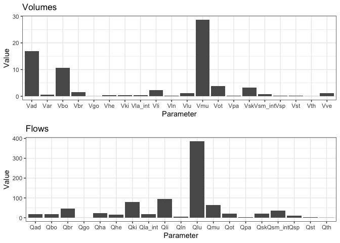
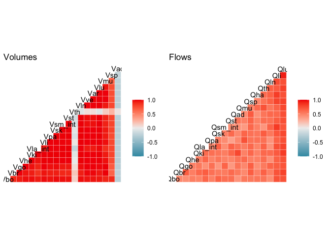
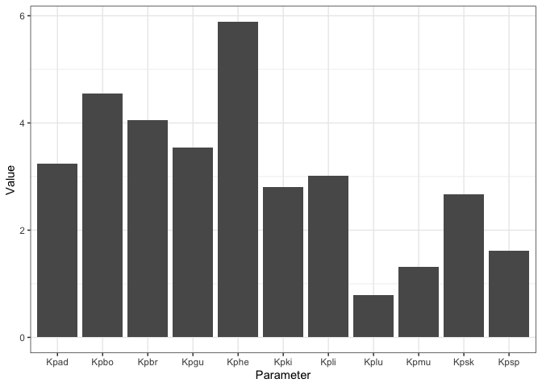
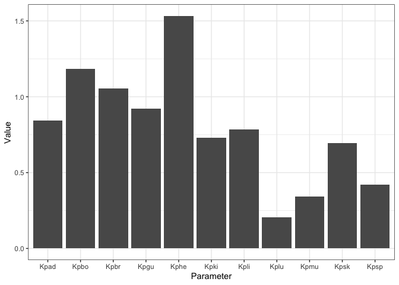

# mrgPBPK

mrgPBPK is an open-source R package that provides a set of functions to
be used for PBPK modeling. The functions mainly generate drug- and
system-specific parameters required to build a PBPK model.

# Load libraries

``` r
library(mrgPBPK)
library(dplyr)
library(ggplot2)
library(cowplot)
library(GGally)
```

# Generate system-specific parameters

System-related (physiologic) parameters required for PBPK modeling are
the organ volumes and blood flows. There are two versions of the
functions that generate the physiologic parameters, a version to be
applied for general PBPK modeling of small molecules and another
specific for monoclonal antibody PBPK modeling.

## General small molecule PBPK modeling

Two functions `genInd` and `genPop` can be used to generate a virtual
individual or a population, respectively, for PBPK modeling of small
molecules. The algorithm used is adapted from Willmann et al 2007
[source](https://pubmed.ncbi.nlm.nih.gov/17431751/) and it maintains a
correlation between the physiologic parameters and the sampled
individual’s covariates to generate realistic individuals. The algorithm
is guided by these databases:

  - NHANES data for anthropometric data
    ([source](https://www.cdc.gov/nchs/nhanes/index.htm)).
  - ICRP data for physiologic parameters of typical individuals
    ([source](https://journals.sagepub.com/doi/pdf/10.1177/ANIB_32_3-4)).
  - Willmann et al 2007 data for organ variability
    ([source](https://pubmed.ncbi.nlm.nih.gov/17431751/)).

The function `genInd` takes age, sex, and two inputs of body weight,
height, and BMI. It returns a named list of the covariates and the
physiologic parameters with volumes prefixed with `V` and flows prefixed
with `Q`. The logical argument `optimize` states if the user wants to
run an additional optimization step on the generated organ volumes. This
step would give better parameter predictions but will take longer to
run.

``` r
# define the individual demographics
## You only need to define two of the three covariates: body weight, height, and BMI
age <- 30
ismale <- TRUE
bw <- 73
ht <- 1.76

# generate individual physiological parameters
indPars <- genInd(age=age, is.male=ismale, bw_targ=bw, ht_targ=ht, optimize = FALSE)
df_indPars <- bind_rows(indPars) %>% select(contains(c("Q","V")))
df_indPars2 <- tibble(Parameter=names(df_indPars), Value=as.numeric(df_indPars))

plot_vols <- ggplot(data=df_indPars2 %>% filter(grepl("V", Parameter)), aes(Parameter, Value)) + geom_col() + theme_bw() + labs(title = "Volumes", y="Volume (L)")
plot_flows <- ggplot(data=df_indPars2 %>% filter(grepl("Q", Parameter)), aes(Parameter, Value)) + geom_col() + theme_bw() + labs(title = "Flows", y="Flow rate (L/h)")

plot_grid(plot_vols, plot_flows, ncol=1)
```

<!-- -->

The function `genPop` takes ranges of ages, and two ranges of body
weights, heights, or BMIs as well as the percentage of females in the
desired population. It returns a named list of lists with the upper
level being the individuals’ IDs and the nested list is each
individual’s covariates and physiologic parameters.

``` r
# define the population demographics
## You only need to define the range for two of the three covariates: body weight, height, and BMI
nSubj <- 40  #number of subjects
minAge <- 20  #minimum age
maxAge <- 80  #maximum age
femPerc <- 50  #percentage of females
minBW <- 50  #minimum body weight
maxBW <- 100  #maximum body weight
minHT <- 1.5  #minimum height
maxHT <- 1.9  #maximum height

# generate population physiological parameters
popPars <- genPop(nSubj=nSubj, minAge=minAge, maxAge=maxAge, femPerc=femPerc, minBW=minBW, maxBW=maxBW, minHT=minHT, maxHT=maxHT, optimize = FALSE)
df_popPars <- bind_rows(popPars) %>% select(ID, everything())

df_popPars <- bind_rows(popPars) %>%
  mutate(SEX = ifelse(SEX == 1, "male", "female"),
         SEX = factor(SEX))
df_vols <- df_popPars %>% 
  select(AGE, HT, BW, SEX, contains("V"))

df_flows <- df_popPars %>% 
  select(AGE, HT, BW, SEX, contains("Q"))

plot_corr_vols <- ggcorr(df_vols %>% select(-SEX, -AGE, -BW, -HT, -Vot)) + labs(title = "Volumes")
plot_corr_flows <- ggcorr(df_flows %>% select(-SEX, -AGE, -BW, -HT, -Qot)) + labs(title = "Flows")
plot_grid(plot_corr_vols, plot_corr_flows, ncol=2)
```

<!-- -->

# Monoclonal antibody PBPK modeling

The functions `genInd_mab` and `genPop_mab` take the same inputs as
`genInd` and `genPop`, respectively, but they return physiologic
parameters to be used for monoclonal antibody (mAb) PBPK modeling. The
parameter names are consistent with the names used in the mAb PBPK model
developed
[here](https://github.com/metrumresearchgroup/bioPBPK/tree/main/mAb_bamlanivimab)
and was based on the model reported by Shah and Betts 2012
([source](https://pubmed.ncbi.nlm.nih.gov/22143261/)) and Jones et al
2019
([source](https://ascpt.onlinelibrary.wiley.com/doi/full/10.1002/psp4.12461)).

``` r
# define the individual demographics
## You only need to define two of the three covariates: body weight, height, and BMI
age <- 30
ismale <- T
bw <- 73
ht <- 1.76

# generate individual physiological parameters
indPars <- genInd_mab(age=age, is.male=ismale, bw_targ=bw, ht_targ=ht)
df_indPars <- bind_rows(indPars)

head(t(df_indPars), 10)
```

    .                [,1]
    . SEX        1.000000
    . BW        73.000000
    . HT         1.760000
    . BMI       23.566632
    . V_Heart    0.366579
    . V_Lung     1.152143
    . V_Muscle  28.748212
    . V_Skin     3.249019
    . V_Adipose 16.829509
    . V_Bone    10.575605

## Generate population physiological parameters

``` r
# define the population demographics
## You only need to define the range for two of the three covariates: body weight, height, and BMI
nSubj <- 40  #number of subjects
minAge <- 20  #minimum age
maxAge <- 80  #maximum age
femPerc <- 50  #percentage of females
minBW <- 50  #minimum body weight
maxBW <- 100  #maximum body weight
minHT <- 1.5  #minimum height
maxHT <- 1.9  #maximum height

# generate population physiological parameters
popPars <- genPop_mab(nSubj=nSubj, minAge=minAge, maxAge=maxAge, femPerc=femPerc, minBW=minBW, maxBW=maxBW, minHT=minHT, maxHT=maxHT)
df_popPars <- bind_rows(popPars) %>% select(ID, everything())

summary(df_popPars[,1:11])
```

    .        ID             SEX            BW              HT             BMI       
    .  Min.   : 1.00   Min.   :1.0   Min.   :58.24   Min.   :1.563   Min.   :19.55  
    .  1st Qu.:10.75   1st Qu.:1.0   1st Qu.:70.96   1st Qu.:1.612   1st Qu.:24.02  
    .  Median :20.50   Median :1.5   Median :80.14   Median :1.675   Median :27.93  
    .  Mean   :20.50   Mean   :1.5   Mean   :79.53   Mean   :1.691   Mean   :27.94  
    .  3rd Qu.:30.25   3rd Qu.:2.0   3rd Qu.:88.24   3rd Qu.:1.763   3rd Qu.:31.40  
    .  Max.   :40.00   Max.   :2.0   Max.   :99.64   Max.   :1.878   Max.   :36.92  
    .     V_Heart           V_Lung          V_Muscle         V_Skin     
    .  Min.   :0.2441   Min.   :0.7050   Min.   :16.59   Min.   :1.701  
    .  1st Qu.:0.2720   1st Qu.:0.8170   1st Qu.:17.74   1st Qu.:2.093  
    .  Median :0.3048   Median :0.9803   Median :22.36   Median :2.515  
    .  Mean   :0.3177   Mean   :0.9824   Mean   :23.16   Mean   :2.655  
    .  3rd Qu.:0.3701   3rd Qu.:1.1598   3rd Qu.:29.02   3rd Qu.:3.282  
    .  Max.   :0.4039   Max.   :1.2452   Max.   :29.90   Max.   :3.819  
    .    V_Adipose          V_Bone      
    .  Min.   : 3.848   Min.   : 7.079  
    .  1st Qu.:19.559   1st Qu.: 7.698  
    .  Median :32.371   Median : 8.732  
    .  Mean   :31.483   Mean   : 9.153  
    .  3rd Qu.:42.198   3rd Qu.:10.531  
    .  Max.   :59.287   Max.   :12.288

# Generate drug-specific parameters

## Calculate tissue:plasma partition coefficients (Kp)

The function `calcKp` can calculate the molecule’s Kp values for
different organs using one of five different calculation methods:

  - PT: Poulin and Theil
    ([source](https://pubmed.ncbi.nlm.nih.gov/11782904/)).
  - RR: Rodgers and Rowland
    ([source1](https://pubmed.ncbi.nlm.nih.gov/15858854/) and
    [source2](https://pubmed.ncbi.nlm.nih.gov/16639716/)).
  - Berez: Berezhkovskiy
    ([source](https://pubmed.ncbi.nlm.nih.gov/15124219/)).
  - Schmitt: Schimtt
    ([source](https://pubmed.ncbi.nlm.nih.gov/17981004/)).
  - pksim: PK-Sim
    ([source](https://www.tandfonline.com/doi/abs/10.1517/17425255.1.1.159)).

The function uses the standardized tissue composition database reported
[here](https://dmd.aspetjournals.org/content/48/10/903)

``` r
# define molecule's physicochemical properties
logP <- 2  #lipophilicity
pKa <- 1  #acidic strength
type <- 3  #type of molecule
BP <- 1  #blood:plasma concentration ratio
fup <- 0.5  #unbound fraction in plasma
method <- "PT"  #prediction method

# calculate partition coefficients
Kps <- calcKp(logP=logP, pKa=pKa, fup=fup, BP=BP, type=type, method=method)
df_Kps <- bind_rows(Kps)
df_Kps2 <- tibble(Parameter=names(df_Kps), Value=as.numeric(Kps))

ggplot(data=df_Kps2, aes(Parameter, Value)) +
  geom_col() + theme_bw()
```

<!-- --> \#\# Calculate
tissue:plasma partition coefficients (Kp) using volume at steady state
(Vss)

If Vss is available, it can be passed to the argument `Vss` of the
`calcKp` function that will then scale the calculated Kp values
accordingly. If `Vss` is provided, the named list containing the
individual’s physiological parameters also need to be passed to the
argument `Vt`. `calcKp` will grab the tissue volumes from this list to
allow for the scaling of the Kp values based on the Vss calculation here
<https://jcheminf.biomedcentral.com/articles/10.1186/s13321-015-0054-x>.
This scaling also requires `Kpot`, which is the partition coefficient
value for the “other” compartment that lumps all compartments that are
not defined in the standardized tissue composition database. If `Kpot`
is left as `NULL`, it will be calculated as the average of all non
adipose tissues Kp values.

``` r
# calculate partition coefficients
Vss <- 50
indPars <- genInd(age=age, is.male=ismale, bw_targ=bw, ht_targ=ht, optimize = FALSE)
Kps <- calcKp(logP=logP, pKa=pKa, fup=fup, BP=BP, type=type, method=method, Vss=Vss, Vt=indPars)
df_Kps <- bind_rows(Kps)
df_Kps2 <- tibble(Parameter=names(df_Kps), Value=as.numeric(Kps))

ggplot(data=df_Kps2, aes(Parameter, Value)) +
  geom_col() + theme_bw()
```

<!-- -->

## Calculate blood:plasma concentration ratio (BP)

In case BP parameter was missing, the function `calcBP` can be used to
calculate BP based on the methods reported
[here](https://pubmed.ncbi.nlm.nih.gov/20549836/). There are two methods
to chose from:

  - Method 1: uses molecule’s fup to calculate BP.
  - Method 2: uses molecule’s logP (or another measurement of
    lipophilicity like logD) to calculate BP.

Note: drug type = “total” is the default type and it uses the regression
coefficients calculated by fitting different molecule types (acids,
bases, and neutrals) together.

``` r
# in case BP parameter was missing, the function calcBP
calcBP(fup = fup, method = 1)
```

    . [1] 0.827023

``` r
calcBP(logP = logP, fup = fup, method = 2)
```

    . [1] 1.034007

## Calculate unbound fraction in plasma (fup)

In case fup parameter was missing, the function `calcFup` can be used to
calculate fup using the molecule’s logP (or another measurement of
lipophilicity like logD) based on the method reported
[here](https://pubmed.ncbi.nlm.nih.gov/20549836/).

``` r
# in case BP parameter was missing, the function calcBP
calcFup(logP = logP)
```

    . [1] 0.2931778
